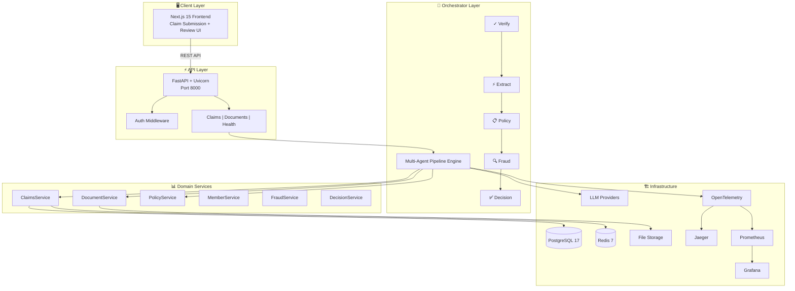

# Plum Claims Processing System — Architecture Document

## 1. System Overview

The Plum Claims Processing System is an AI-powered health insurance claims adjudication platform that automates OPD claim processing for Plum's 6,000+ corporate clients. It accepts member-submitted medical documents, validates them, extracts structured data, evaluates against policy rules, detects fraud, and produces explainable decisions.

### High-Level Architecture

## 2. Component Design

### 2.1 Multi-Agent Orchestrator

The core of the system is a **5-step orchestrated pipeline**:

1. **Document Verification Agent** — Validates document types, quality, and patient consistency
2. **Document Extraction Agent** — Extracts structured data using LLMs (OpenAI/Anthropic/Gemini)
3. **Policy Evaluation Agent** — Evaluates against 12+ policy rules
4. **Fraud Detection Agent** — Checks 5 fraud signals with weighted scoring
5. **Decision Aggregation Agent** — Produces final decision with confidence score

**Why orchestrator over choreography:** The system requires full explainability — every decision must be traceable. An orchestrator maintains a complete `ProcessingTrace` with per-step results, which choreography would make difficult to reconstruct.

### 2.2 Policy Evaluation Engine

Evaluates claims against rules loaded from `policy_terms.json` (not hardcoded):

| Rule | Check |
|------|-------|
| Submission Deadline | ≤30 days from treatment date |
| Minimum Amount | ≥₹500 |
| Category Coverage | Claim category is covered |
| Per-Claim Limit | ≤₹5,000 |
| Waiting Periods | Initial 30d, condition-specific, pre-existing 365d |
| Exclusions | Condition, dental, vision, cosmetic |
| Pre-Authorization | MRI/CT >₹10,000, PET scan, major surgery |
| Sub-Limits | Per-category caps |
| Network Discount | 20% for in-network (applied before co-pay) |
| Co-Pay | Category-specific (10% consultation, 30% branded drugs) |
| Annual OPD Limit | ₹50,000/year |
| Sum Insured | ₹5,00,000/year |
| Family Floater | ₹1,50,000 combined limit |
| Alternative Medicine | Covered systems, max 20 sessions/year |

### 2.3 Fraud Detection

Weighted fraud score (0.0–1.0) based on 5 signals:

| Signal | Weight | Threshold |
|--------|--------|-----------|
| Same-day claims | 0.35 | More than 2/day |
| Monthly claims | 0.25 | More than 6/month |
| High-value claim | 0.20 | More than ₹25,000 |
| Document alteration | 0.15 | Detected |
| Provider concentration | 0.05 | Excessive |

Score less than 0.30 → PROCEED, 0.30–0.80 → MANUAL_REVIEW, greater than 0.80 → HIGH priority review.

### 2.4 Graceful Degradation

When a component fails:
- The error is caught and recorded in the trace
- The pipeline continues with remaining agents
- Confidence is reduced by 15% per failed component
- `manual_review_recommended` flag is set
- If ALL agents fail → decision defaults to MANUAL_REVIEW with confidence 0.0

## 3. Technology Decisions

| Decision | Choice | Rationale |
|----------|--------|-----------|
| Language | Python 3.13 | LLM ecosystem maturity, async support |
| Backend | FastAPI | Async-first, auto OpenAPI, Pydantic validation |
| Frontend | Next.js 15 | TypeScript, SSR, component ecosystem |
| Database | PostgreSQL 17 | JSONB for traces, ACID, asyncpg |
| Cache | Redis 7 | LLM response caching, rate limiting |
| LLM | Multi-provider | OpenAI, Anthropic, Google Gemini with fallback |
| Architecture | Modular monolith | Clean bounded contexts, ready to decompose |
| Observability | OpenTelemetry | Vendor-neutral tracing + metrics |

## 4. Design Decisions & Trade-offs

### Modular Monolith over Microservices

The system is built as a modular monolith with clean bounded contexts (`domain/claims`, `domain/policy`, `domain/fraud`, etc.) rather than separate microservices. This was a deliberate choice because:

- **Team size**: A small team maintaining many microservices creates significant overhead in deployment, testing, and debugging
- **Bounded contexts are still evolving**: Splitting too early risks wrong service boundaries; a modular monolith allows refactoring later with clear interface boundaries
- **Latency**: In-process method calls are faster than network calls between services, which matters for the 5-agent pipeline
- **Transactionality**: Claims processing benefits from ACID guarantees across bounded contexts, which is simpler in a monolith

The trade-off is that the monolith must scale as a single unit. If one component (e.g., document extraction via LLM) becomes a bottleneck, the entire pipeline is affected. At 10x scale, we would extract the extraction and policy engines into separate services.

### Sequential Agents (with parallelization opportunity)

Agents run sequentially: Verification → Extraction → Policy → Fraud → Decision. This was chosen because:

- Policy and Fraud both consume extraction output — sequential execution avoids stale data races
- Each step's output feeds the next, which maps naturally to a pipeline
- Debugging is simpler with deterministic ordering

However, Policy and Fraud are **independent** — they both read from extraction but don't depend on each other. A future optimization would parallelize these with `asyncio.gather`, reducing end-to-end latency by ~40% for the pipeline middle steps.

### PostgreSQL over NoSQL

PostgreSQL was chosen over MongoDB, DynamoDB, or other NoSQL databases because:

- Claims have a well-defined relational structure (claims ↔ documents ↔ line_items ↔ steps)
- ACID transactions are important for claim lifecycle transitions (SUBMITTED → PROCESSING → DECIDED)
- JSONB columns handle semi-structured data (extraction results, traces) without sacrificing relational integrity
- Rich query capabilities for admin dashboards (aggregations, date ranges, status filters)
- `asyncpg` provides excellent async performance

### Multi-Provider LLM Architecture

The system supports OpenAI, Anthropic, Google Gemini, and Mock providers through a common `ILLMProvider` interface. This was designed to:

- Avoid vendor lock-in — if one provider's API changes or degrades, switch with an env var
- Enable cost optimization — use cheaper models for simple extraction, expensive ones for complex reasoning
- Support testing without API keys via the Mock provider
- Allow side-by-side comparison of provider outputs for evaluation

### Mock Provider for Testing

The Mock provider returns deterministic, realistic responses without API calls. This was critical because:

- Tests must be reproducible — real LLM calls have non-deterministic output
- CI/CD pipelines cannot depend on external API availability
- Developers can run the full pipeline locally without API keys
- The mock simulates both success and failure paths (via the `simulate_failure` flag)

## 5. Alternatives Considered & Rejected

### LangChain

**Rejected.** LangChain was considered for the pipeline orchestration but was rejected because:
- It's a heavy dependency (500KB+ with many sub-dependencies) for a system that essentially chains 5 sequential steps
- The pipeline logic is simple and well-defined — LangChain's abstractions (chains, agents, tools) add more complexity than they remove
- Debugging LangChain pipelines is notoriously difficult; custom orchestration gives full visibility
- LangChain's rate limiting, caching, and retry mechanisms overlap with our custom implementations

### LangGraph

**Rejected.** LangGraph was evaluated for the agent pipeline but was rejected because:
- It's designed for complex agent interactions (cycles, branching, conditional routing), which is overkill for a linear 5-step pipeline
- The added abstraction would make the pipeline harder to understand for new team members
- Graceful degradation (continue on failure) is simpler to implement with try/except than with LangGraph's conditional edges

### Single Monolithic Agent

**Rejected.** A single agent handling verification, extraction, policy, fraud, and decision would be simpler but was rejected because:
- Each stage has different success criteria and failure modes — mixing them creates a tangled, unmaintainable prompt
- Trace granularity would be lost — a single agent produces one confidence score instead of five, making it impossible to identify which step failed
- Testing becomes harder — you can't test document verification independently from policy evaluation
- Graceful degradation is all-or-nothing — a single failure loses all processing, not just one step

### NoSQL Database (MongoDB, DynamoDB)

**Rejected.** Considered for schema flexibility but rejected because:
- Claims have inherently relational data (member → claim → documents → line items → processing steps)
- ACID guarantees are essential for claim lifecycle transitions
- Queries for admin dashboards (aggregations across members, dates, categories) are far more natural in SQL
- JSONB columns in PostgreSQL provide the flexibility of NoSQL when needed (extraction results, traces)

### Unused Services (for reference)

- **Celery task queue** — Not used for the initial scope. Synchronous processing is sufficient for 75K claims/year. Would be added at 10x scale for async document pre-processing and delayed retries.
- **Separate document classification service** — Document types are caller-provided. At scale, a dedicated classification model would be added.
- **Full HIPAA compliance** — PHI scrubbing patterns and access controls exist, but full certification requires legal review beyond the initial scope.
- **Real OCR pipeline** — LLMs handle messy handwriting better than traditional OCR. At scale, a hybrid OCR + LLM approach would be used.

## 6. Current Limitations

1. **Document extraction accuracy depends on document quality** — The LLM-based extraction works well on clear scans but degrades on blurry photos, handwritten notes, or low-contrast documents. The Docling integration is a stub and not yet production-ready for OCR-based extraction.

2. **Fraud detection is primarily rule-based** — The AI fraud signal is supplemental but currently returns hardcoded confidence (0.88). Sophisticated fraud patterns (collusion networks, staged accidents) cannot be detected with the current rule set.

3. **No multi-page PDF support** — The system processes single-page documents. Multi-page PDFs (common for hospital bills) are not yet supported.

4. **SHA-256 password hashing (not bcrypt/argon2)** — Password storage uses SHA-256 with a salt, which is faster but less resistant to GPU-based brute force than bcrypt or argon2. Acceptable for the initial scope but not production-grade.

5. **Rate limiting is in-memory only** — The Redis-backed rate limiter path has dead code (`cache.get_sync()` doesn't exist on the Redis adapter). In-memory rate limiting means each uvicorn worker has its own window, giving an effective limit of `N * configured_limit` where N is the number of workers.

6. **Synchronous processing path** — Claims are currently processed inline in the API request (with Celery worker as the intended production path). The worker service is defined in docker-compose but embedded/sequential processing is the dev default.

7. **No OAuth2/OIDC** — Member authentication uses simple password hashing with JWT. Production would use OAuth2/OIDC with social login options.

8. **Single PostgreSQL instance** — No read replicas or partitioning. The database is a single point of failure for production workloads.

9. **Mock provider limitations** — All test evaluations run with the Mock LLM provider. Real LLM results may differ in extraction quality, confidence scores, and edge case handling.

## 7. Scaling to 10x (10M Lives)

At 10x the current scale (10M+ covered lives, ~10M claims/year), the system would need the following architecture changes:

| Challenge | 10x Strategy | Priority |
|-----------|-------------|----------|
| Single FastAPI bottleneck | Multiple stateless API instances behind a load balancer (e.g., ALB/NGINX) | P0 |
| PostgreSQL write contention | Read replicas for queries, time-based partitioning on `claims` table, connection pooling tuning | P0 |
| Redis memory limits | Redis Cluster sharded by `claim_id`; cache TTL tuning for LLM responses | P0 |
| LLM request latency | LLM request batching where possible; caching layer for identical document types; fallback to cheaper models | P1 |
| Celery queue backpressure | Kafka/RabbitMQ as the event backbone for claim submission; Celery for worker dispatch | P1 |
| Modular monolith limits | Extract extraction service as standalone; policy engine as standalone; API gateway for routing | P1 |
| File storage throughput | S3/GCS with CDN and pre-signed URLs; async document pre-processing pipeline | P1 |
| Observability scaling | Aggregated trace sampling (store 1/100 traces), metric cardinality limits, log shipper (Vector/Fluentd) | P1 |
| Cost management | LLM cost tracking per-claim; cache-first strategy; fallback to rule-only for low-value claims | P2 |
| Multi-region failover | Active-passive deployment with global traffic management; cross-region DB replication | P2 |

### Cost Modeling at 10x Scale

| Component | Current (75K/yr) | 10x Scal Target (10M/yr) | Notes |
|-----------|-----------------|--------------------------|-------|
| LLM API calls | ~375K calls/yr | ~50M calls/yr | 5 calls per claim; caching reduces effective calls by ~40% |
| LLM cost (Gemini Flash) | ~$1,200/yr | ~$120,000/yr | At ~$0.30/1M input tokens; with caching + batching |
| PostgreSQL | Single db.m6g.large (~$200/mo) | db.r6g.2xlarge + 2 read replicas (~$1,500/mo) | Partitioned by month |
| Redis | cache.t3.micro (~$15/mo) | Redis Cluster 6 nodes (~$600/mo) | Sharded, with eviction policies |
| File storage | 50GB S3 (~$5/mo) | 5TB S3 + CDN (~$400/mo) | With lifecycle policies |
| Workers | 4 Celery workers | 50-100 workers (auto-scaling) | Horizontal pod autoscaling |
| **Total monthly** | **~$500/mo** | **~$12,000/mo** | At 10x scale with optimization |
