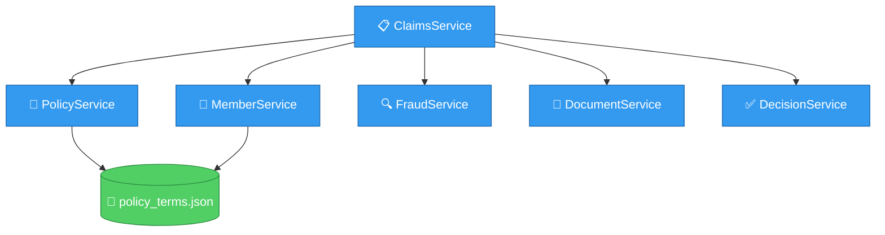
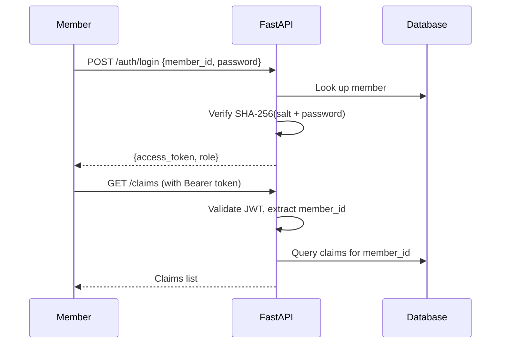

# Backend Architecture

The backend is a FastAPI application organized as a modular monolith with clear separation between HTTP, business logic, and infrastructure.

## Tech stack

| Component | Technology | Purpose |
|-----------|-----------|---------|
| Web framework | FastAPI | Async REST API with auto-generated OpenAPI docs |
| ORM | SQLAlchemy 2.0 (async) | Database models and queries |
| Task queue | Celery + Redis | Async claim processing |
| Database | PostgreSQL (asyncpg) | Persistent storage |
| Cache | Redis | LLM response caching, rate limiting |
| Logging | structlog | Structured JSON logging with PHI redaction |
| Tracing | OpenTelemetry → Jaeger | Distributed tracing |
| Metrics | Prometheus | Business and system metrics |

## API endpoints

### Public endpoints

| Method | Path | Purpose |
|--------|------|---------|
| `POST` | `/api/v1/auth/login` | Authenticate and get JWT |
| `POST` | `/api/v1/auth/register` | Register a member |
| `GET` | `/health` | Health check |
| `GET` | `/ready` | Readiness check (DB, Redis, LLM) |
| `GET` | `/metrics` | Prometheus metrics |

### Member endpoints (requires JWT)

| Method | Path | Purpose |
|--------|------|---------|
| `POST` | `/api/v1/claims` | Submit a claim (JSON) |
| `POST` | `/api/v1/claims/upload` | Submit with file uploads |
| `GET` | `/api/v1/claims` | List my claims |
| `GET` | `/api/v1/claims/{id}` | Get claim detail |
| `GET` | `/api/v1/claims/{id}/trace` | Get processing trace |
| `GET` | `/api/v1/claims/{id}/events` | Get event audit trail |
| `POST` | `/api/v1/claims/{id}/retry` | Retry a failed claim |
| `POST` | `/api/v1/documents/upload` | Upload a document |
| `GET` | `/api/v1/documents/db/{id}/view` | View document file |

### Admin endpoints (requires admin role)

| Method | Path | Purpose |
|--------|------|---------|
| `GET` | `/api/v1/admin/dashboard` | Aggregate stats |
| `GET` | `/api/v1/admin/claims` | List all claims with filters |
| `GET` | `/api/v1/admin/claims/{id}` | Full claim detail |
| `POST` | `/api/v1/admin/claims/{id}/override` | Override decision |
| `POST` | `/api/v1/admin/claims/{id}/comment` | Add internal note |
| `POST` | `/api/v1/admin/claims/{id}/rerun` | Rerun full pipeline |
| `GET` | `/api/v1/admin/members` | List members |

## Domain services

Six bounded contexts, each with its own models and service:



| Service | Responsibility |
|---------|---------------|
| `ClaimsService` | Claim lifecycle: create, update, list, events, retries |
| `MemberService` | Member auth, claims summary, family floater tracking |
| `PolicyService` | All policy rule evaluation (12+ rules) |
| `FraudService` | Rule-based fraud scoring with weighted signals |
| `DocumentService` | Document verification and data extraction |
| `DecisionService` | Final verdict aggregation |

## LLM providers

The system supports four LLM providers, switchable via config:

| Provider | Adapter | Use case |
|----------|---------|----------|
| OpenAI | `OpenAIAdapter` | GPT-4o, supports structured JSON output |
| Anthropic | `AnthropicAdapter` | Claude, handles thinking blocks |
| Google | `GoogleGeminiAdapter` | Gemini, supports multimodal (images, PDFs) |
| Mock | `MockLLMAdapter` | Testing, returns schema-compliant mock data |

All providers implement the same interface:

```python
class ILLMProvider(ABC):
    async def chat(self, request: LLMRequest) -> LLMResponse
    async def extract_structured(self, request: LLMRequest) -> dict
    async def health_check(self) -> bool
```

LLM responses are cached using content-addressable SHA-256 keys in Redis (24h TTL for chat, 7 days for extraction).

## Auth system



- JWT tokens contain `sub` (member_id), `role`, `iat`, `exp`
- Passwords are hashed with SHA-256 + random 16-byte salt
- Rate limiting: 60 requests/minute per member (sliding window in Redis)

## Error handling

Custom exception hierarchy:

```
PlumException (base)
├── DocumentValidationError (422)
├── ClaimValidationError (422)
├── ResourceNotFoundError (404)
├── PolicyLoadError
├── PolicyRuleViolation
├── LLMProviderError
├── StorageProviderError
└── ExtractionError
```

All errors return structured JSON:

```json
{
  "error": {
    "code": "DOCUMENT_VALIDATION",
    "message": "Missing required document: HOSPITAL_BILL",
    "details": {"required_type": "HOSPITAL_BILL", "claim_category": "CONSULTATION"}
  }
}
```
