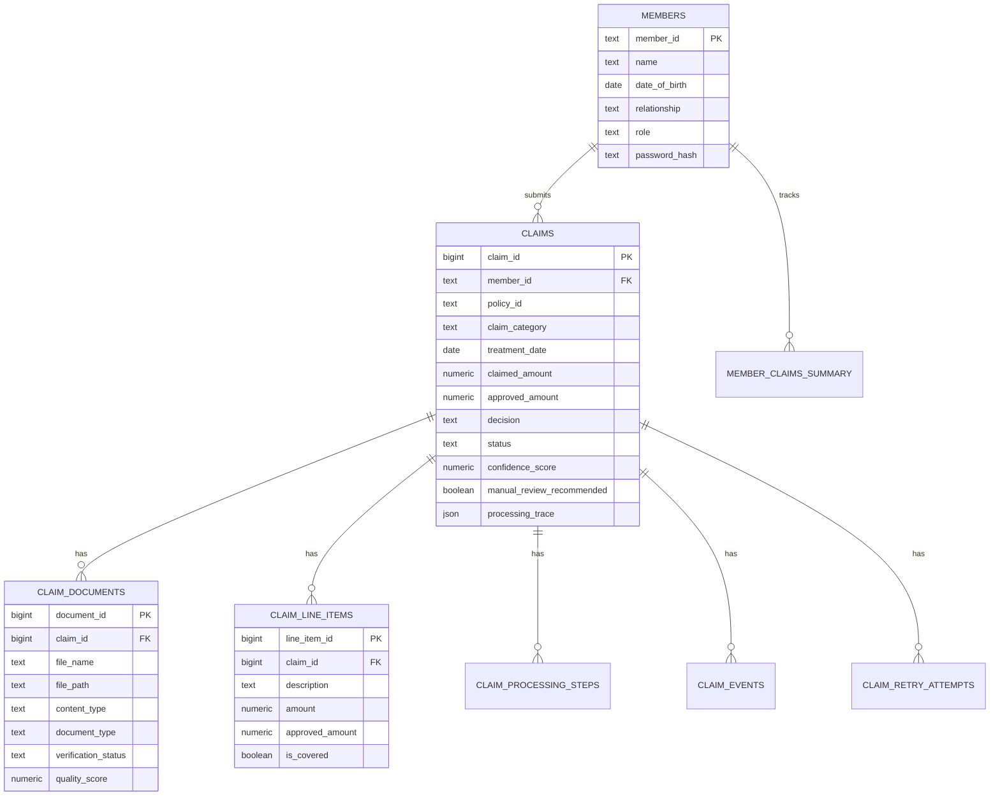

# Database Schema

The system uses PostgreSQL with 7 tables, managed by SQLAlchemy async ORM.

## Entity relationship diagram

## Tables

### claims

The core table. Every claim starts as SUBMITTED and progresses through the pipeline.

| Column | Type | Description |
|--------|------|-------------|
| `claim_id` | BigInteger (PK) | Auto-increment ID |
| `member_id` | Text | Who submitted the claim |
| `policy_id` | Text | Which policy applies |
| `claim_category` | Text | CONSULTATION, DIAGNOSTIC, PHARMACY, DENTAL, VISION, ALTERNATIVE_MEDICINE |
| `treatment_date` | Date | When the treatment happened |
| `claimed_amount` | Numeric(10,2) | How much the member claimed |
| `approved_amount` | Numeric(10,2) | How much is approved (after pipeline) |
| `decision` | Text | APPROVED, PARTIAL, REJECTED, MANUAL_REVIEW |
| `decision_reason` | Text | Human-readable explanation |
| `confidence_score` | Numeric(3,2) | 0.00 to 1.00 |
| `status` | Text | SUBMITTED → PROCESSING → DECIDED |
| `processing_trace` | JSON | Full pipeline execution log |
| `degraded_components` | JSON | List of agents that failed |

### claim_documents

Documents attached to a claim. Status is updated after verification.

| Column | Type | Description |
|--------|------|-------------|
| `document_id` | BigInteger (PK) | Auto-increment ID |
| `claim_id` | BigInteger (FK) | Which claim this belongs to |
| `file_name` | Text | Original filename |
| `file_path` | Text | Storage path |
| `content_type` | Text | MIME type (image/png, application/pdf) |
| `document_type` | Text | PRESCRIPTION, HOSPITAL_BILL, etc. |
| `verification_status` | Text | PENDING, VERIFIED, WRONG_TYPE, UNREADABLE, FAILED |
| `quality_score` | Numeric(3,2) | Document readability score |

### claim_line_items

Individual line items extracted from hospital bills.

| Column | Type | Description |
|--------|------|-------------|
| `line_item_id` | BigInteger (PK) | Auto-increment ID |
| `claim_id` | BigInteger (FK) | Which claim |
| `description` | Text | What the item is (e.g., "Consultation Fee") |
| `amount` | Numeric(10,2) | Claimed amount for this item |
| `approved_amount` | Numeric(10,2) | Approved amount for this item |
| `is_covered` | Boolean | Whether this item is covered |
| `rejection_reason` | Text | Why it's not covered (if applicable) |

### claim_processing_steps

Audit trail for each pipeline step. One record per agent per claim.

| Column | Type | Description |
|--------|------|-------------|
| `step_id` | BigInteger (PK) | Auto-increment ID |
| `claim_id` | BigInteger (FK) | Which claim |
| `step_index` | Integer | 0-4 (one per agent) |
| `step_name` | Text | "Document Verification", "Policy Evaluation", etc. |
| `agent_name` | Text | "verification_agent", "policy_agent", etc. |
| `status` | Text | STARTED, COMPLETED, FAILED, SKIPPED |
| `confidence_score` | Numeric(3,2) | Agent's confidence |
| `checks_performed` | JSON | Array of {check, passed, reason} |
| `duration_ms` | Integer | How long it took |

### claim_events

Complete audit trail for every state change.

| Column | Type | Description |
|--------|------|-------------|
| `event_id` | BigInteger (PK) | Auto-increment ID |
| `claim_id` | BigInteger (FK) | Which claim |
| `event_type` | Text | SUBMITTED, DECISION_MADE, ADMIN_OVERRIDE, etc. |
| `actor_type` | Text | USER, SYSTEM, ADMIN |
| `actor_id` | Text | Who triggered it |
| `comment` | Text | Optional comment |
| `event_metadata` | JSON | Additional context |

### members

Employee and dependent records.

| Column | Type | Description |
|--------|------|-------------|
| `member_id` | Text (PK) | EMP001, DEP001, etc. |
| `name` | Text | Full name |
| `date_of_birth` | Date | For age-based rules |
| `relationship` | Text | SELF, SPOUSE, CHILD, PARENT |
| `role` | Text | member, admin, reviewer |
| `password_hash` | Text | salt:hash format |

### member_claims_summary

Materialized aggregation for fast policy checks.

| Column | Type | Description |
|--------|------|-------------|
| `member_id` | Text | Who |
| `year` | Integer | Which year |
| `total_claims_count` | Integer | How many claims |
| `approved_claims_amount` | Numeric(12,2) | Total approved amount |
| `family_approved_amount` | Numeric(12,2) | Family floater used |
| `same_day_claim_count` | Integer | For fraud detection |
| `sessions_used_this_year` | Integer | For alt medicine limits |
