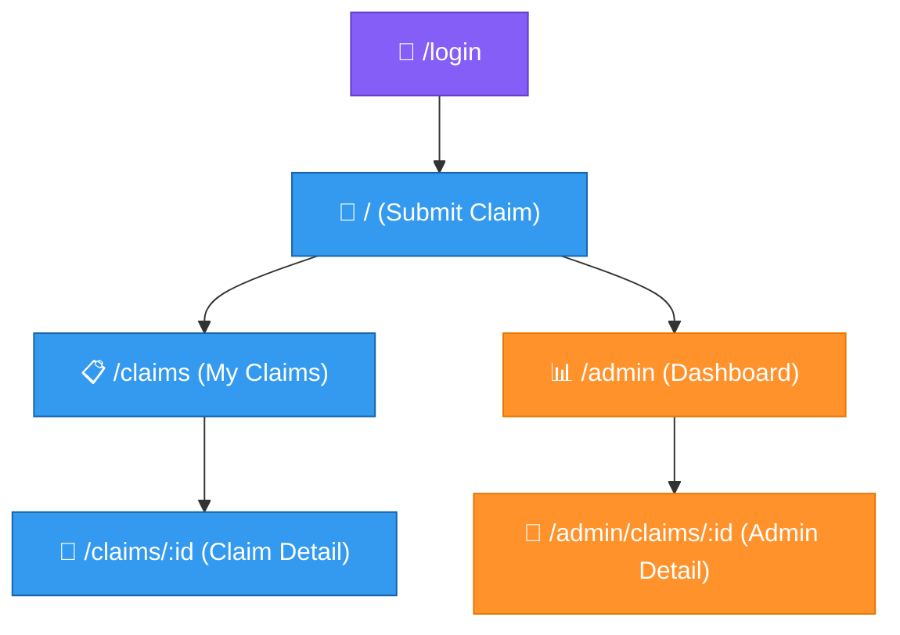
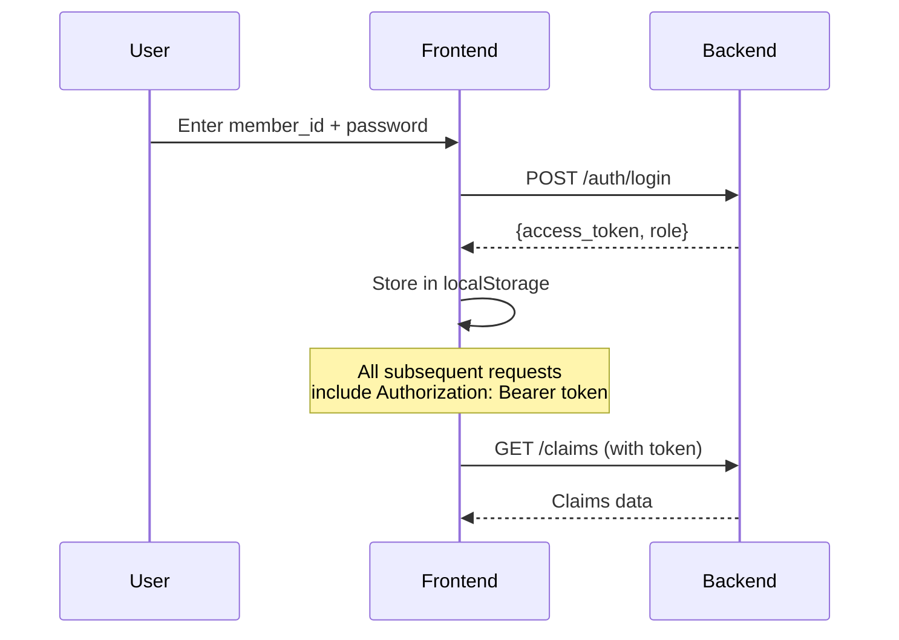

# Frontend Architecture

The frontend is a Next.js app with client-side rendering, role-based access, and a custom design system built on Tailwind CSS.

## Tech stack

| Component | Technology | Purpose |
|-----------|-----------|---------|
| Framework | Next.js 15 (App Router) | Routing, SSR shell |
| UI | React 19 | Component rendering |
| Styling | Tailwind CSS + CSS custom properties | Design tokens, utility classes |
| State | React useState/useEffect + Context | Local and auth state |
| HTTP | Fetch API | REST API calls |

## Pages



| Route | Page | Who can see it |
|-------|------|---------------|
| `/login` | Login and registration | Everyone |
| `/` | Claim submission form | Logged-in members |
| `/claims` | My claims list with tab filters | Logged-in members |
| `/claims/:id` | Claim detail with documents | Logged-in members |
| `/admin` | Admin dashboard with stats | Admins only |
| `/admin/claims/:id` | Admin claim detail with actions | Admins only |

## Member vs Admin views

<Columns cols={2}>
  <Card title="Member view" icon="user">
    - Submit claims with file upload
    - View own claims with status tabs
    - See decision, amounts, reasoning
    - Preview uploaded documents
    - Retry failed claims with new documents
  </Card>
  <Card title="Admin view" icon="shield">
    - Everything a member can do, plus:
    - Dashboard with aggregate stats
    - View ALL claims across all members
    - See processing trace and confidence scores
    - Override decisions
    - Add internal comments
    - Rerun full pipeline
    - View complete event history
  </Card>
</Columns>

## Components

### UI components

| Component | Purpose |
|-----------|---------|
| `StatusBadge` | Colored pill for claim status (SUBMITTED, PROCESSING, DECIDED, etc.) |
| `DecisionBadge` | Colored pill for decision (APPROVED, REJECTED, etc.) |
| `MetricCard` | Stat card with label and value |
| `LoadingSpinner` | Animated spinner with message |
| `FailureReasonCard` | Human-readable error display with icons |
| `CustomSelect` | Accessible dropdown with keyboard navigation |
| `CustomFileUploader` | Drag-and-drop file upload with type selection |

### Claims components

| Component | Purpose |
|-----------|---------|
| `DocumentList` | Expandable document list with image/PDF preview |
| `LineItemsTable` | Table of claim line items with coverage status |
| `ProcessingTraceViewer` | Collapsible pipeline steps with checks and timing |

## Design system

CSS custom properties define the color palette:

```css
:root {
  --color-primary-500: #6366f1;  /* Indigo */
  --color-success-500: #22c55e;  /* Green */
  --color-warning-500: #f59e0b;  /* Amber */
  --color-danger-500: #ef4444;   /* Red */
  --color-info-500: #0ea5e9;     /* Sky blue */
}
```

Color semantics:
- **Green** = success, approved
- **Yellow/amber** = warning, processing
- **Red** = error, rejected
- **Blue** = info, submitted
- **Purple** = admin actions
- **Orange** = manual review

## Real-time updates

The frontend polls for updates:

| Page | Poll interval | When |
|------|--------------|------|
| My Claims | 5 seconds | While any claim is PROCESSING |
| Claim Detail | 3 seconds | While claim is SUBMITTED/PROCESSING/VALIDATING |
| Admin Dashboard | 10 seconds | Always |
| Admin Claim Detail | 3 seconds | While claim is being reprocessed |

## API client

All API calls go through `src/lib/api.ts`:

```typescript
// Member endpoints
submitClaim(request)           // POST /claims
submitClaimWithFiles(formData) // POST /claims/upload
getClaim(claimId)              // GET /claims/:id
listClaims(params)             // GET /claims
retryClaim(claimId, comment)   // POST /claims/:id/retry

// Admin endpoints
getAdminDashboard()            // GET /admin/dashboard
adminOverride(claimId, ...)    // POST /admin/claims/:id/override
adminRerunClaim(claimId)       // POST /admin/claims/:id/rerun

// Shared
getDocumentViewUrl(docId)      // Returns URL for document preview
```

## Auth flow



Auth state is stored in `localStorage`:
- `plum_token` — JWT access token
- `plum_member_id` — Logged-in member ID
- `plum_member_name` — Display name
- `plum_role` — "member" or "admin"
