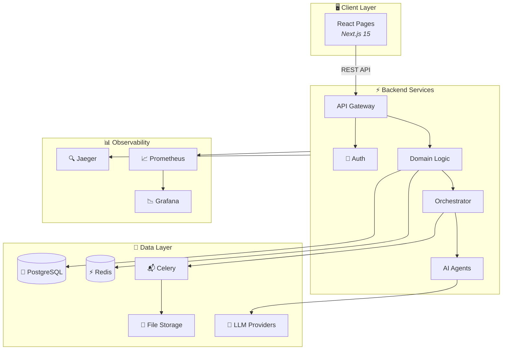
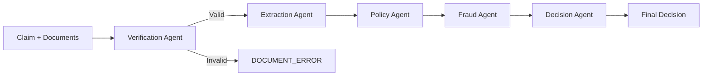

# Architecture Overview

The system is a modular monolith organized into five layers, each with a clear responsibility.

## System architecture



## Layer responsibilities

| Layer | Package | What it does |
|-------|---------|-------------|
| **API** | `backend/api/` | HTTP routes, request validation, auth middleware, response schemas |
| **Domain** | `backend/domain/` | Business logic for claims, members, policy, fraud, documents, decisions |
| **Orchestrator** | `backend/orchestrator/` | Multi-agent pipeline engine, async task dispatch, processing state |
| **Providers** | `backend/providers/` | Pluggable adapters for DB, cache, storage, LLM, document processing |
| **Core** | `backend/core/` | Config, DI container, exceptions, logging, telemetry, serialization |

## Key design decisions

### 1. Multi-agent pipeline

Instead of one monolithic function, the claim processing is split into five specialized agents:



Each agent:
- Has a single responsibility
- Can fail independently (graceful degradation)
- Records every check it performs
- Returns a confidence score

### 2. Graceful degradation

If a non-critical agent fails, the pipeline continues with lower confidence:


Only document verification is a hard stop — if documents are wrong, the pipeline halts immediately.

### 3. Pluggable providers

Every external dependency has an interface and multiple adapters:

| Provider | Interface | Adapters |
|----------|-----------|----------|
| Database | SQLAlchemy async | PostgreSQL, SQLite |
| Cache | `ICacheProvider` | Redis, In-Memory |
| Storage | `IStorageProvider` | Local, MinIO, S3 |
| LLM | `ILLMProvider` | OpenAI, Anthropic, Google Gemini, Mock |
| Document Processing | `IDocumentProcessor` | Hybrid (Docling + Vision LLM) |

### 4. Dependency injection

A singleton `Container` class lazy-initializes all providers based on config:

```python
container = get_container()
llm = container.llm        # → GoogleGeminiAdapter (from config)
storage = container.storage # → LocalStorageAdapter (from config)
cache = container.cache     # → RedisCacheAdapter (from config)
```

### 5. Async processing

Claims are processed asynchronously via Celery:

1. API returns `202 Accepted` immediately
2. Celery worker picks up the task
3. Worker creates its own DB session (avoids event loop conflicts)
4. Pipeline runs, updates claim in DB
5. Frontend polls every 3 seconds for status updates

## Directory structure

```
src/
├── api/                    # HTTP layer
│   ├── v1/
│   │   ├── auth.py         # Login/register endpoints
│   │   ├── claims.py       # Claim CRUD endpoints
│   │   ├── documents.py    # Document upload/download
│   │   └── admin.py        # Admin management endpoints
│   ├── auth.py             # JWT creation/validation
│   ├── middleware.py        # Rate limiting, correlation ID
│   └── schemas/            # Pydantic request/response models
├── domain/                 # Business logic
│   ├── claims/             # Claim lifecycle, models
│   ├── member/             # Member management, auth
│   ├── policy/             # Policy rule evaluation
│   ├── fraud/              # Fraud detection
│   ├── documents/          # Document verification/extraction
│   └── decision/           # Final decision aggregation
├── orchestrator/           # Pipeline engine
│   ├── engine.py           # 5-step pipeline orchestrator
│   ├── tasks.py            # Celery async tasks
│   ├── state.py            # Processing trace/state
│   └── agents/             # Individual AI agents
├── providers/              # External integrations
│   ├── cache/              # Redis, in-memory
│   ├── db/                 # SQLAlchemy session
│   ├── llm/                # OpenAI, Anthropic, Gemini, Mock
│   ├── storage/            # Local, MinIO, S3
│   └── doc_processing/     # Document processor
└── core/                   # Cross-cutting concerns
    ├── config.py            # Pydantic settings
    ├── container.py         # DI container
    ├── exceptions.py        # Exception hierarchy
    ├── logging.py           # Structured logging with PHI redaction
    └── telemetry.py         # OpenTelemetry tracing/metrics
```
