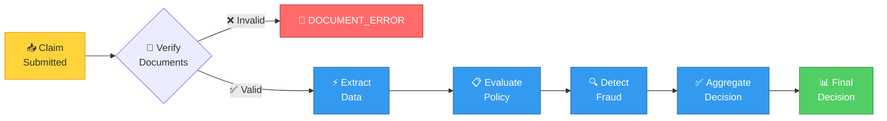
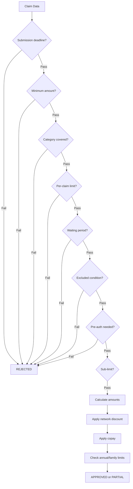
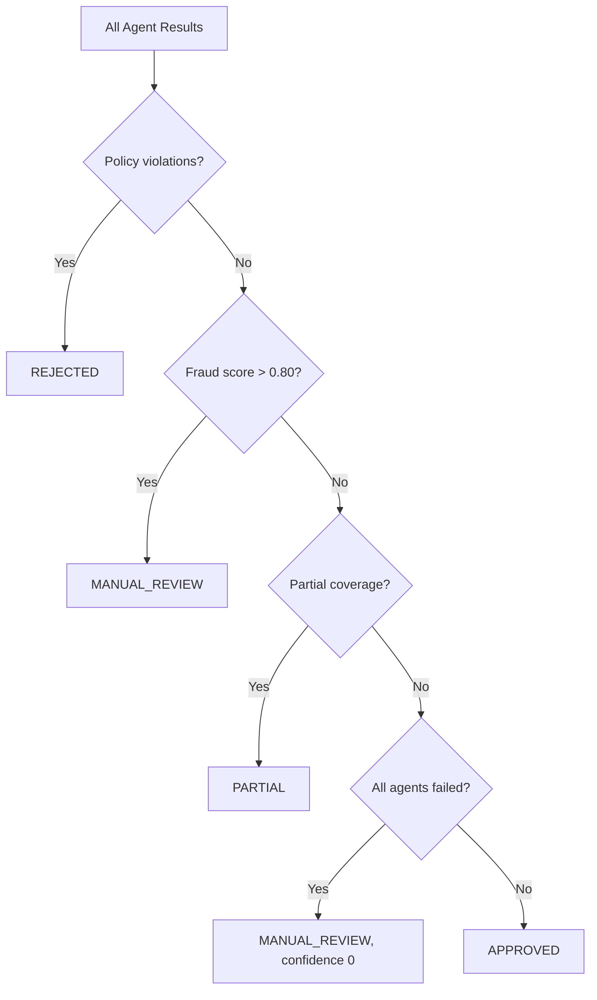

# Processing Pipeline

Every claim goes through a 5-step pipeline. Each step is handled by a specialized AI agent.

## Pipeline flow



## Step 0: Document Verification

**Agent**: `VerificationAgent`
**Can stop pipeline**: Yes

Checks that the uploaded documents meet policy requirements for the claim category.

| Check | What it does |
|-------|-------------|
| Required types | Are all required document types present? |
| Wrong types | Did the member upload the wrong document type? |
| Quality | Are documents readable (not blurry/corrupt)? |
| Patient match | Do all documents belong to the same patient? |

If any check fails, the pipeline stops immediately with `DOCUMENT_ERROR` status. The error message tells the member exactly what went wrong and what they need to upload instead.

**Example**: For a CONSULTATION claim, the system requires PRESCRIPTION + HOSPITAL_BILL. If the member uploads two prescriptions, it stops and says: "You uploaded PRESCRIPTION documents, but a HOSPITAL_BILL is required."

## Step 1: Document Extraction

**Agent**: `ExtractionAgent`
**Degrades on failure**: Yes

Extracts structured data from verified documents using AI.

| Document type | Fields extracted |
|--------------|-----------------|
| Prescription | Doctor name, registration, patient, date, diagnosis, medicines |
| Hospital Bill | Hospital name, patient, date, line items, total |
| Lab Report | Lab name, patient, test name, result, date |
| Pharmacy Bill | Pharmacy name, patient, medicines, total |

The agent handles multiple content types:
- **Images** (PNG, JPG): Sent to vision-capable LLM for OCR
- **PDFs**: Sent to LLM with PDF support
- **Pre-extracted data** (test mode): Used directly with AI validation

If extraction fails, the pipeline continues with confidence 0.0 — the policy agent will work with whatever data it has.

## Step 2: Policy Evaluation

**Agent**: `PolicyAgent`
**Degrades on failure**: Yes

Evaluates the claim against 12+ policy rules:



**Financial calculation order**:
1. Start with claimed amount
2. Remove excluded line items
3. Apply network discount (if applicable)
4. Apply copay percentage
5. Check against sub-limit, per-claim limit, annual limit, family floater

## Step 3: Fraud Detection

**Agent**: `FraudAgent`
**Degrades on failure**: Yes

Evaluates fraud risk using weighted signals:

| Signal | Weight | Trigger |
|--------|--------|---------|
| Same-day excess | 0.35 | More than 2 claims on the same day |
| Monthly excess | 0.25 | More than 6 claims in a month |
| High value | 0.20 | Claim amount exceeds ₹25,000 |
| Document alteration | 0.15 | Suspicious patterns in documents |
| Provider concentration | 0.05 | All claims at same hospital |

A fraud score above 0.80 triggers `MANUAL_REVIEW`. The system never auto-rejects for fraud — it always routes to a human.

## Step 4: Decision Aggregation

**Agent**: `DecisionAgent`
**Degrades on failure**: No (final step)

Combines all agent results into a final decision:



The final decision includes:
- **Decision**: APPROVED, PARTIAL, REJECTED, or MANUAL_REVIEW
- **Approved amount**: After all discounts and copays
- **Confidence score**: Based on extraction quality, policy check pass rate, and degradation
- **Decision reason**: Human-readable explanation

## Confidence calculation

The confidence score is computed as:

```
confidence = extraction_confidence × policy_pass_ratio × fraud_penalty × degradation_penalty
```

| Factor | Range | Effect |
|--------|-------|--------|
| Extraction confidence | 0.0–1.0 | 0 if extraction failed |
| Policy pass ratio | 0.0–1.0 | Ratio of policy checks that passed |
| Fraud penalty | 0.5–1.0 | 0.5 if fraud score > 0.5 |
| Degradation penalty | 0.5–1.0 | 0.5 per failed agent |

## Graceful degradation

Each agent (except Decision) can fail independently:

| Agent | On failure | Pipeline continues? |
|-------|-----------|-------------------|
| Verification | Stop pipeline | No — documents are invalid |
| Extraction | Confidence drops to 0 | Yes — policy works with claimed amount |
| Policy | Decision defaults to MANUAL_REVIEW | Yes — fraud still runs |
| Fraud | Score defaults to 0 | Yes — decision uses policy result |
| Decision | N/A | Final step — never fails |

## Processing trace

Every step records a complete trace:

```json
{
  "step_index": 2,
  "step_name": "Policy Evaluation",
  "agent_name": "policy_agent",
  "status": "COMPLETED",
  "confidence_score": 0.88,
  "duration_ms": 2080,
  "checks_performed": [
    {
      "rule": "COPAY",
      "passed": true,
      "reason": "Co-pay 10% applied on ₹1499: ₹149.90 deducted. Final: ₹1349.10.",
      "copay_percent": 10.0,
      "copay_amount": 149.9
    }
  ]
}
```
