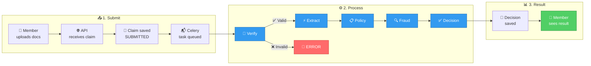

# End-to-End Claim Flow

Follow a claim from submission to final decision.

## The journey of a claim



## Example: Clean consultation claim

**Member**: EMP001 (Rajesh Kumar)
**Claim**: Consultation, ₹1,500
**Documents**: prescription.png, hospital_bill.png

### Step 1: Submission

Member fills in the form and uploads two images:

{/* SCREENSHOT: Claim submission form with document upload */}

```json
{
  "member_id": "EMP001",
  "claim_category": "CONSULTATION",
  "treatment_date": "2024-11-01",
  "claimed_amount": 1500,
  "documents": [
    {"file_name": "prescription.png", "actual_type": "PRESCRIPTION"},
    {"file_name": "hospital_bill.png", "actual_type": "HOSPITAL_BILL"}
  ]
}
```

API returns `202 Accepted` immediately. Claim is saved as `SUBMITTED`.

### Step 2: Verification

The Verification Agent checks:
- CONSULTATION requires PRESCRIPTION + HOSPITAL_BILL
- Member uploaded both types
- Both are readable (quality check)

Result: All checks passed → `is_valid: true`

### Step 3: Extraction

The Extraction Agent sends the images to the vision LLM:

**Prescription extracted**:
```json
{
  "doctor_name": "Dr. Arun Sharma",
  "patient_name": "Rajesh Kumar",
  "diagnosis": "Viral Fever",
  "medicines": ["Paracetamol 650mg", "Vitamin C 500mg"]
}
```

**Hospital bill extracted**:
```json
{
  "hospital_name": "City Clinic, Bengaluru",
  "line_items": [
    {"description": "Consultation Fee", "amount": 1000},
    {"description": "CBC Test", "amount": 300},
    {"description": "Dengue NS1 Test", "amount": 200}
  ],
  "total": 1500
}
```

### Step 4: Policy evaluation

The Policy Agent runs 12+ rules:

| Rule | Result | Details |
|------|--------|---------|
| Submission deadline | ✅ Pass | 0 days since treatment |
| Minimum amount | ✅ Pass | ₹1,500 ≥ ₹500 |
| Category covered | ✅ Pass | CONSULTATION is covered |
| Per-claim limit | ✅ Pass | ₹1,500 ≤ ₹5,000 |
| Waiting period | ✅ Pass | No waiting period |
| Excluded condition | ✅ Pass | No exclusion |
| Pre-authorization | ✅ Pass | Not required |
| Sub-limit | ✅ Pass | ₹1,500 ≤ ₹2,000 |
| Co-pay | ✅ Pass | 10% applied: ₹150 deducted |
| Annual limit | ✅ Pass | Within ₹50,000 |
| Sum insured | ✅ Pass | Within ₹5,00,000 |
| Family floater | ✅ Pass | Within ₹1,50,000 |

**Calculation**:
- Claimed: ₹1,500
- Copay (10%): -₹150
- **Approved: ₹1,350**

### Step 5: Fraud detection

| Signal | Score | Result |
|--------|-------|--------|
| Same-day claims | 0 | Only 1 claim today |
| Monthly claims | 0 | Well within limit |
| High value | 0 | Below ₹25,000 threshold |

**Fraud score**: 0.05 (LOW) → PROCEED

### Step 6: Decision

All agents passed. No policy violations, no fraud signals.

**Final decision**: APPROVED
**Approved amount**: ₹1,350
**Confidence**: 0.92

{/* SCREENSHOT: Successful claim decision with full trace */}

### Result

Member sees:

```
Claim #6 — CONSULTATION
Status: DECIDED
Decision: ✅ APPROVED
Claimed: ₹1,500
Approved: ₹1,349.10
Confidence: 92%

Decision Summary:
"The claim is valid and meets all policy requirements.
10% co-pay of ₹149.90 applied. Final approved: ₹1,349.10."
```

## Example: Wrong documents

**Member**: EMP001
**Claim**: Consultation, ₹1,500
**Documents**: Two prescriptions (no hospital bill)

### Verification fails

{/* SCREENSHOT: Document error message (TC001 - wrong document type) */}

```
Error: MISSING_REQUIRED
"You uploaded PRESCRIPTION document(s), but a HOSPITAL_BILL is required.
For CONSULTATION claims, you must upload: PRESCRIPTION, HOSPITAL_BILL.
Please upload the missing HOSPITAL_BILL and resubmit."
```

Pipeline stops immediately. Claim status: `DOCUMENT_ERROR`

Member can retry with the correct documents.

## Example: Component failure

**Scenario**: LLM extraction times out

### What happens

1. Verification passes
2. Extraction fails (LLM timeout)
3. Pipeline continues with `extraction_confidence: 0.0`
4. Policy evaluation works with claimed amount (no extracted data)
5. Fraud detection runs normally
6. Decision agent notes the degradation

**Result**: APPROVED (if policy rules pass), but with lower confidence (0.45) and `manual_review_recommended: true`

The processing trace shows exactly which component failed and why.
