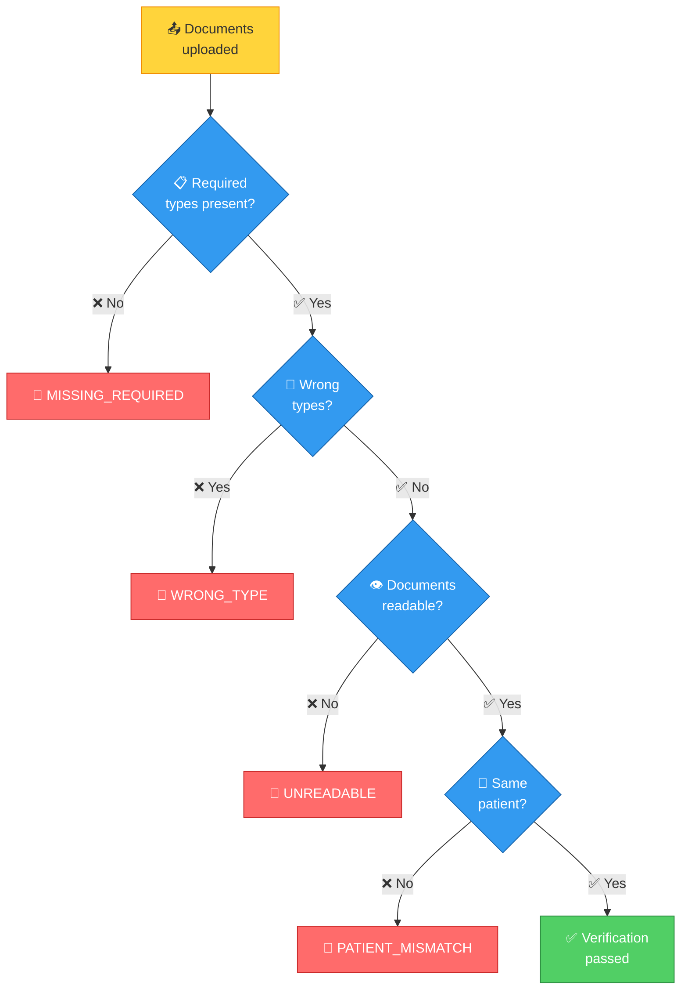

# Document Processing

The system handles multiple document types and formats — images, PDFs, and pre-extracted data.

## Document types

| Type | Required for | Fields extracted |
|------|-------------|-----------------|
| PRESCRIPTION | Most categories | Doctor, patient, diagnosis, medicines, date |
| HOSPITAL_BILL | Most categories | Hospital, line items, total, date |
| LAB_REPORT | DIAGNOSTIC | Lab, test name, result, date |
| PHARMACY_BILL | PHARMACY | Pharmacy, medicines, total |
| DENTAL_REPORT | DENTAL | Dentist, procedure, date |
| DISCHARGE_SUMMARY | DIAGNOSTIC (optional) | Hospital, diagnosis, date |

## Document requirements per category

| Category | Required | Optional |
|----------|----------|----------|
| CONSULTATION | PRESCRIPTION, HOSPITAL_BILL | LAB_REPORT, DIAGNOSTIC_REPORT |
| DIAGNOSTIC | PRESCRIPTION, LAB_REPORT, HOSPITAL_BILL | DISCHARGE_SUMMARY |
| PHARMACY | PRESCRIPTION, PHARMACY_BILL | — |
| DENTAL | HOSPITAL_BILL | PRESCRIPTION, DENTAL_REPORT |
| VISION | PRESCRIPTION, HOSPITAL_BILL | — |
| ALTERNATIVE_MEDICINE | PRESCRIPTION, HOSPITAL_BILL | — |

## Verification flow



Error messages are specific — they name the uploaded type and the required type.

## Extraction routes

The system handles four types of document content:

### 1. Image files (PNG, JPG)

Sent to a vision-capable LLM (Google Gemini, GPT-4o) for OCR:

```
Image → base64 encode → Vision LLM → Structured JSON
```

### 2. PDF files

Sent to LLM with PDF support:

```
PDF → base64 encode → LLM → Structured JSON
```

### 3. Pre-extracted data (test mode)

Structured JSON passed directly — runs AI validation to check for non-medical content:

```json
{
  "doctor_name": "Dr. Sharma",
  "diagnosis": "Viral Fever",
  "medicines": ["Paracetamol"]
}
```

### 4. Plain text

Sent to LLM for structured extraction:

```
Text → LLM → Structured JSON
```

## Extraction schemas

Each document type has a JSON schema the LLM must fill:

**Prescription**:
```json
{
  "doctor_name": "string",
  "patient_name": "string",
  "date": "string",
  "diagnosis": "string",
  "medicines": ["string"]
}
```

**Hospital Bill**:
```json
{
  "hospital_name": "string",
  "patient_name": "string",
  "date": "string",
  "line_items": [
    {"description": "string", "amount": number}
  ],
  "total": number
}
```

## Document viewing

Uploaded documents are stored on disk (or S3/MinIO) and served via:

```
GET /api/v1/documents/db/{document_id}/view
```

The frontend renders:
- **Images**: Inline `` with click-to-expand
- **PDFs**: Inline `<iframe>` with "open in new tab" link
- **Other**: Download link

## Storage providers

| Provider | Config | Use case |
|----------|--------|----------|
| Local | `STORAGE_PROVIDER=local` | Development |
| MinIO | `STORAGE_PROVIDER=minio` | Self-hosted S3-compatible |
| S3 | `STORAGE_PROVIDER=s3` | Production AWS |

All providers implement the same interface:

```python
class IStorageProvider(ABC):
    async def upload(self, file_name, content, content_type) -> StoredFile
    async def download(self, file_path) -> bytes
    async def delete(self, file_path) -> None
    async def exists(self, file_path) -> bool
```
