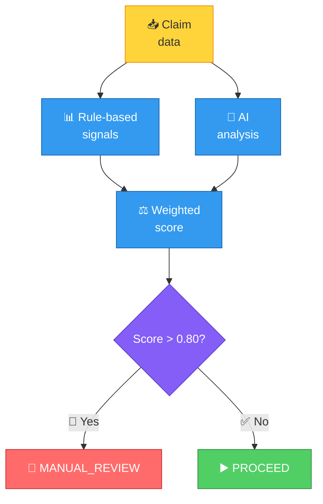

# Fraud Detection

The Fraud Agent evaluates claims for suspicious patterns using rule-based scoring and AI analysis.

## How it works



## Fraud signals

| Signal | Weight | Trigger threshold |
|--------|--------|------------------|
| Same-day excess | 0.35 | More than 2 claims on same day |
| Monthly excess | 0.25 | More than 6 claims in a month |
| High value | 0.20 | Claim amount > ₹25,000 |
| Document alteration | 0.15 | Suspicious patterns detected |
| Provider concentration | 0.05 | All claims at same hospital |

## Scoring

Each signal contributes a weighted score:

```
fraud_score = (same_day × 0.35) + (monthly × 0.25) + (high_value × 0.20) + (alteration × 0.15) + (concentration × 0.05)
```

| Score range | Action |
|-------------|--------|
| 0.0 – 0.3 | PROCEED (low risk) |
| 0.3 – 0.5 | PROCEED (medium risk, flagged) |
| 0.5 – 0.8 | PROCEED (elevated risk, flagged) |
| 0.8+ | MANUAL_REVIEW |

## Example scenarios

### Low risk (PROCEED)

- 1 claim today, well within monthly limit
- Amount under ₹25,000
- No suspicious patterns

**Score**: 0.05 → PROCEED

### Medium risk (PROCEED with flags)

- 2 claims today (at limit)
- Amount ₹20,000

**Score**: 0.35 → PROCEED (flags: same-day limit reached)

### High risk (MANUAL_REVIEW)

- 4 claims today (exceeds limit of 2)
- Previous claims this month: 5

**Score**: 0.85 → MANUAL_REVIEW

## Important behavior

- The system **never auto-rejects** for fraud
- High fraud scores route to `MANUAL_REVIEW` for human decision
- Fraud signals are included in the processing trace for transparency
- The admin can override any fraud-based MANUAL_REVIEW decision

## AI analysis

In addition to rule-based signals, the Fraud Agent uses an LLM to analyze:

- Claim patterns relative to member history
- Document content for inconsistencies
- Amount patterns for the claim category

The AI analysis is combined with rule-based scoring for the final recommendation.
