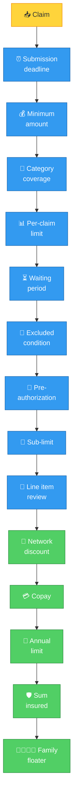

# Policy Rules

The Policy Agent evaluates 12+ rules against every claim. Rules are defined in `policy_terms.json`.

## Rule evaluation order

## Rule details

### Submission deadline

Claims must be submitted within 30 days of treatment.

### Minimum amount

Claim must be at least ₹500.

### Category coverage

Six categories are covered: CONSULTATION, DIAGNOSTIC, PHARMACY, DENTAL, VISION, ALTERNATIVE_MEDICINE.

### Per-claim limit

Maximum ₹5,000 per claim.

### Waiting periods

| Condition | Waiting period |
|-----------|---------------|
| Initial (any claim) | 30 days from join date |
| Pre-existing conditions | 365 days |
| Diabetes | 90 days |
| Hypertension | 90 days |
| Thyroid disorders | 90 days |
| Joint replacement | 730 days |
| Maternity | 270 days |
| Mental health | 180 days |
| Obesity treatment | 365 days |

### Excluded conditions

These are never covered:
- Self-inflicted injuries
- Substance abuse
- Experimental treatments
- Infertility/assisted reproduction
- Obesity/weight loss programs
- Bariatric surgery
- Cosmetic/aesthetic procedures
- Health supplements/tonics

### Pre-authorization

Required for high-value diagnostic tests:
- MRI (amount > ₹10,000)
- CT scan (amount > ₹10,000)
- PET scan (any amount)
- Major surgical procedures
- Planned hospitalization

Pre-auth is valid for 30 days.

### Sub-limits per category

| Category | Sub-limit |
|----------|-----------|
| Consultation | ₹2,000 |
| Diagnostic | ₹10,000 |
| Pharmacy | ₹15,000 |
| Dental | ₹10,000 |
| Vision | ₹5,000 |
| Alternative Medicine | ₹8,000 |

### Copay

| Category | Copay |
|----------|-------|
| Consultation | 10% |
| Diagnostic | 0% |
| Pharmacy (generic) | 0% |
| Pharmacy (branded) | 30% |
| Dental | 0% |
| Vision | 0% |
| Alternative Medicine | 0% |

### Network discount

| Category | Discount |
|----------|----------|
| Consultation | 20% |
| Diagnostic | 10% |

Network hospitals: Apollo, Fortis, Max, Manipal, Narayana, Medanta, Kokilaben, Aster CMI, Columbia Asia, Sakra World.

### Financial calculation order

1. Start with claimed amount
2. Remove excluded line items
3. Apply network discount (if network hospital)
4. Apply copay percentage
5. Check against sub-limit
6. Check against per-claim limit
7. Check against annual OPD limit (₹50,000)
8. Check against sum insured (₹5,00,000)
9. Check against family floater (₹1,50,000)

## Category-specific rules

### Dental

**Covered procedures**: Root Canal, Tooth Extraction, Filling, Scaling/Polishing, X-Ray, Crown Placement, Gum Treatment

**Excluded procedures**: Teeth Whitening, Veneers, Orthodontics (Braces), Cosmetic Implants, Bleaching

### Vision

**Covered**: Glasses, Contact Lenses, Eye Examination, Cataract Surgery

**Excluded**: LASIK, Cosmetic Eye Surgery, Refractive Surgery

### Alternative Medicine

- Must be from registered practitioner
- Maximum 20 sessions per year
- Covers: Ayurveda, Homeopathy, Unani, Siddha, Naturopathy
