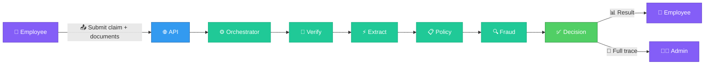

# AI Claims Processing

An automated health insurance claims processing platform that uses a multi-agent AI pipeline to verify documents, extract data, evaluate policy rules, detect fraud, and produce fully explainable claim decisions.

## What does it do?

When an employee submits a health insurance claim with medical documents (bills, prescriptions, lab reports), the system:

1. **Validates documents** — checks that the right document types were uploaded for the claim category
2. **Extracts structured data** — uses AI to read handwritten prescriptions, phone photos, and PDFs
3. **Applies policy rules** — evaluates 12+ rules (copay, limits, waiting periods, exclusions, pre-auth)
4. **Detects fraud** — flags suspicious patterns like too many same-day claims
5. **Makes a decision** — produces APPROVED, PARTIAL, REJECTED, or MANUAL_REVIEW with full reasoning

Every decision includes a complete audit trail showing exactly what was checked, what passed, and why.

## Key features

<Columns cols={2}>
  <Card title="Multi-Agent Pipeline" icon="robot">
    Five specialized AI agents work together: verification, extraction, policy, fraud, and decision.
  </Card>
  <Card title="Explainable Decisions" icon="magnifying-glass">
    Every check, rule, and decision is recorded in a processing trace you can inspect.
  </Card>
  <Card title="Graceful Degradation" icon="shield-check">
    If one agent fails, the pipeline continues with lower confidence instead of crashing.
  </Card>
  <Card title="Admin Dashboard" icon="chart-bar">
    Override decisions, rerun pipelines, add comments, and view full audit trails.
  </Card>
</Columns>

## System at a glance

## Tech stack

| Layer | Technology |
|-------|-----------|
| Backend | FastAPI, SQLAlchemy, Celery, PostgreSQL, Redis |
| Frontend | Next.js, React, Tailwind CSS |
| AI/LLM | Google Gemini, OpenAI, Anthropic (pluggable) |
| Observability | OpenTelemetry, Jaeger, Prometheus, Grafana |
| Storage | Local filesystem, MinIO, S3 (pluggable) |

## Quick links

<Columns cols={3}>
  <Card title="Architecture" icon="diagram-project" href="/architecture/overview">
    System design and component diagram
  </Card>
  <Card title="Claim Flow" icon="route" href="/guides/claim-flow">
    End-to-end claim processing walkthrough
  </Card>
  <Card title="API Reference" icon="code" href="/guides/api-reference">
    All REST API endpoints
  </Card>
</Columns>
