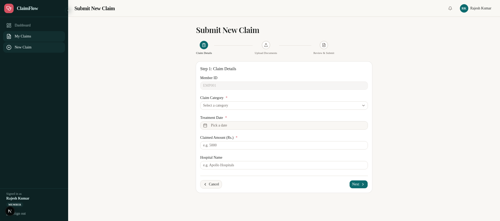

# 📸 Screenshot Guide for Plum Claims Processing System

> **Purpose:** This guide maps screenshots to specific sections of the assignment deliverables and docs. Screenshots are stored in `/workspace/screenshots/`.

---

## Screenshot Inventory

| # | Screenshot | Description | Use In |
|---|-----------|-------------|--------|
| 1 | `01-dashboard.png` | Member dashboard with stats (72 claims, ₹1,85,498 total) and recent claims list | Architecture doc, README |
| 2 | `document-error.png` | Document error display — patient name mismatch detected and shown to user | **Demo Video** (TC003), Document Verification docs |
| 3 | `03-admin-dashboard-current.png` | Admin overview panel | Architecture doc, Admin guide |
| 4 | `04-new-claim-form.png` | New claim submission form with document upload | **Demo Video**, Claim Flow docs |
| 5 | `05-document-error-fixed.png` | Improved document error with user-friendly messages | **Demo Video** (after fix), Document Verification docs |
| 6 | `06-dashboard-fixed.png` | Dashboard after fixes — improved UI with accessibility | Frontend docs |
| 7 | `07-claims-list.png` | Claims list with status filters and search | README, Claim Flow docs |
| 8 | `trace.png` | Approved claim with full trace, line items, and confidence breakdown | **Demo Video** (TC004), Observability docs |

---

## Required Screenshots for Assignment Deliverables

### For Demo Video (8-12 min)

The assignment requires showing:

1. **"A claim stopped early due to a document problem"** → Use `document-error.png` or `05-document-error-fixed.png`
2. **"A successful end-to-end approval with the full trace visible"** → Use `trace.png`
3. **"One technical decision you're proud of"** → Show the multi-agent pipeline trace from `trace.png`
4. **"One thing you'd change given more time"** → Mention the Celery worker production setup or Redis rate limiter

### Additional Recommended Screenshots

| Screenshot | What to Capture | Where It Goes |
|-----------|----------------|---------------|
| 📸 **Jaeger Trace** | Jaeger UI at http://localhost:16686 showing a claim trace | `docs/guides/observability.mdx` |
| 📸 **Grafana Dashboard** | Grafana at http://localhost:3001 with claims metrics | `docs/guides/observability.mdx` |
| 📸 **API Docs** | Swagger UI at http://localhost:8000/docs | `docs/guides/api-reference.mdx` |
| 📸 **Admin Claim Override** | Admin claim detail page with override buttons | Admin docs |
| 📸 **New Claim Success** | Success toast after claim submission | Claim Flow docs |
| 📸 **Processing State** | Claim in PROCESSING state with pulsing indicator | Claim Flow docs |

---

## Screenshot Naming Convention

```
{screenshot-number}-{short-description}.png
```

Examples:
- `01-dashboard.png` — Dashboard overview
- `trace.png` — Approved claim with trace

All screenshots should be placed in `/workspace/screenshots/` and the filename referenced in docs using the path `screenshots/XX-description.png`.

---

## How to Take Screenshots

### Using Browser DevTools (Manual)
1. Open Chrome/Firefox DevTools (F12)
2. Press Ctrl+Shift+P → "Capture full size screenshot"
3. Save to `/workspace/screenshots/`

### Using Playwright (Automated)
```bash
npx playwright screenshot http://localhost:3000/dashboard screenshots/01-dashboard.png --full-page
```

### Services to Screenshot

| Service | URL | Notes |
|---------|-----|-------|
| **Frontend** | http://localhost:3000 | Main app |
| **API Docs** | http://localhost:8000/docs | Swagger UI |
| **API Redoc** | http://localhost:8000/redoc | Alternative docs |
| **Jaeger** | http://localhost:16686 | Distributed tracing |
| **Prometheus** | http://localhost:9095 | Metrics |
| **Grafana** | http://localhost:3001 | Dashboards (admin/admin) |
| **Health Check** | http://localhost:8000/health | API health |

---

## Placeholder Locations in Docs

These are the locations where screenshots are referenced:

| Doc File | Placeholder |
|----------|------------|
| `docs/guides/claim-flow.mdx` | `<!-- SCREENSHOT: ... -->` (3 placeholders) |
| `docs/guides/observability.mdx` | `<!-- SCREENSHOT: ... -->` (3 placeholders) |

When screenshots are captured, replace the `<!-- SCREENSHOT: ... -->` comments with actual image references:
```markdown

```
